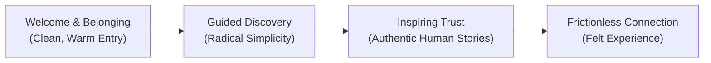

# The Grainger Experience: Human-Centered Design Specifications
## An Elevated Visual & Experience System inspired by Joe Gebbia & Airbnb Design Philosophy

This document reimagines and elevates the design specifications of **The Grainger College of Engineering** (derived from https://grainger.illinois.edu/) through the lens of human-centered design, trust, and storytelling. It shifts the paradigm of institutional utility toward an **experience-first platform** that fosters belonging, clarity, and delight.

---

## 1. Core Design Philosophy: "The Hosted Journey"

A university website shouldn't feel like a digital catalog of departments; it should feel like a host welcoming a guest into a home of innovation.



1.  **Design for Belonging:** Every pixel should convey warmth and inclusivity. Visitors (prospective students, parents, researchers) are treated as **guests** embarking on a life-changing journey.
2.  **Radical Simplicity (Breathing Room):** Institutional sites are notoriously dense. We introduce generous whitespace, clear visual hierarchies, and remove structural clutter to let critical information breathe.
3.  **Human-Centered Storytelling:** Shift the focus from buildings and text blocks to *people*. Photography must capture candid, authentic moments of collaboration, curiosity, and triumph.
4.  **The "11-Star" Touchpoints:** Go beyond functional utility. A student registration form or an alumni donation button should be designed to delight, making the guest feel supported, seen, and valued at every step.

---

## 2. Elevated Color System: Warmth Meets Heritage

While preserving the essential university colors, we introduce a sophisticated balancing system to avoid harsh, overly academic high-contrast blocks, replacing them with a warm, editorial layout.

### Brand Colors (Heritage Anchors)
*   **Illini Blue** (`#13294B`): The anchor of trust. Used for core typography, navigation, and grounding structural elements.
*   **Illini Orange** (`#FF5F05`): The spark of energy. Reserved strictly for high-value interactive calls-to-action and playful micro-moments. Never overused as solid full-screen background blocks.

### The Warmth Accent (The Airbnb Touch)
*   **Altgeld Orange** (`#C84113`): Our primary interactive text and secondary brand accent. Chosen for its beautiful, deep saturation and strong compliance with WCAG 2.1 AA accessibility guidelines.
*   **Champaign Warm Neutral** (`#FBF9F6`): A soft, warm off-white background that replaces clinical gray. It evokes the feel of premium textured paper, adding an editorial and hospitable tone.
*   **Charcoal Dark Text** (`#1E2229`): Softened black for body text to reduce eye strain and feel more organic.

---

## 3. Typography: Editorial Clarity

We elevate the institutional font pairings to feel literary, human, and highly legible.

| Font Family | Role / Persona | Design Intent |
| :--- | :--- | :--- |
| **Montserrat** | The Modern Voice | Clean, geometric, and friendly. Used in medium to semi-bold weights for headings, prioritizing letter-spacing (tracking) for a spacious, contemporary feel. |
| **Georgia** | The Storyteller | A classic, literary serif. Used for introductory paragraphs, quotes, and narratives to introduce a distinguished, reflective, and human element. |
| **Source Sans Pro** | The Workhorse | An exceptionally legible sans-serif for body copy, interactive UI elements, and technical tables. Soft, clean, and highly readable. |

### Responsive Typographic Hierarchy
*   **Hero Message:** `3.25rem` / `52px` (Montserrat, Light to Medium weight with generous line-height) — friendly and welcoming rather than loud and shouting.
*   **Editorial Intro:** `1.5rem` / `24px` (Georgia, Italic) — sets a warm, narrative tone for articles and landing pages.
*   **Section Header:** `1.85rem` / `30px` (Montserrat, Semi-Bold, Slate) — clear, spacious.
*   **Body Copy:** `1.05rem` / `17px` (Source Sans Pro, Line-Height: `1.65`, Charcoal) — designed for comfortable long-form reading.

---

## 4. Key UI Components & Layout Reimagined

### 4.1 Header & Welcome Navigation
Instead of overwhelming visitors with a sprawling institutional mega-menu on day one, we focus on a clean, intentional navigation bar.
*   **Simplification:** Group links into three conversational guest mindsets: *Discover* (About, News), *Join* (Admissions, Academics), and *Partner* (Research, Corporate, Alumni).
*   **The Welcome Wordmark:** The **Block I** logo is paired with a clean, high-contrast, elegant typographic lockup.
*   **Frictionless Search:** The search input expands gracefully upon click, dimming the surrounding page to help the guest focus.

### 4.2 Reimagined Cards: "The Story Host"
Cards are our primary tool for storytelling. Rather than standard, sharp-edged image containers, they are elevated into premium editorial frames.

```
+------------------------------------------+
|                                          |
|            Candid Photography            |
|       (Authentic, Human Focus)           |
|                                          |
+------------------------------------------+
|  May 28, 2026                            |
|  THE BREAKTHROUGH                        |
|                                          |
|  How a new river delta study is          |
|  protecting coastal communities.         |
|                                          |
|  -> Read Story                           |
+------------------------------------------+
```

*   **Soft Geometry:** Subtle rounded corners (`8px` border-radius) to convey warmth and friendliness.
*   **Candid Photography First:** Images should depict real students or faculty actively engaged in their environment, capturing genuine emotion and natural lighting. No stiff, posed corporate headshots.
*   **Hover States (Delight):** Gentle lift shadows and soft image scaling (`transform: scale(1.02)`) that react naturally to the mouse cursor, creating a tactile and organic interface.

### 4.3 Experiential Video Banners
*   **Cinematic Backgrounds:** High-quality, slow-motion background loops showing collaboration, student life, and innovative research.
*   **Warm Overlay:** Replace harsh high-contrast blue blocks with a soft, semi-transparent warm dark overlay to ensure copy remains highly readable while preserving the visual depth of the background.
*   **Play Micro-interactions:** Play buttons animate with a subtle, expanding pulse effect to invite interaction.

---

## 5. Trust & The Guest Experience Checklist

To elevate this design system to true premium standards, every page layout must satisfy the **Guest Experience Checklist**:

*   [ ] **Can it breathe?** Ensure at least 40% of the viewport is whitespace.
*   [ ] **Is it human?** Make sure a human face or personal story is visible above the fold on all landing pages.
*   [ ] **Is the copy conversational?** Rephrase dense academic jargon into clear, welcoming language.
*   [ ] **Is the transition smooth?** All interactive states must have a minimum `200ms ease-in-out` transition.
*   [ ] **Is it accessible to all?** Ensure high contrast compliance and logical screen-reader navigation hierarchies.
